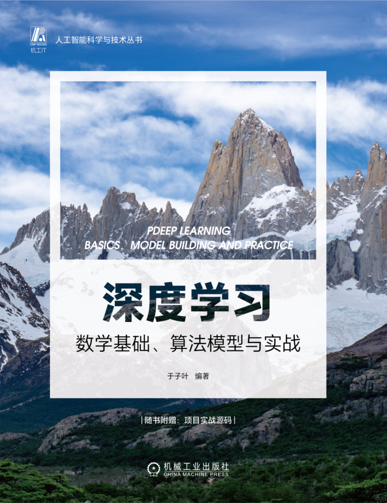

### 书籍《深度学习：数学基础、算法模型与实战》配套代码 

[京东链接](https://item.jd.com/10072294405560.html)
### 代码运行

1. 代码请到相应章节文件夹中运行
2. 代码中需要部分数据，小型数据在data文件夹中，可以拷贝到章节文件夹中，或者创建软链接。
3. 所有章节模型保存在ckpt文件夹下
4. 输出图像保存在输出图像文件夹下
5. 小型数据集、输出图像、模型下载地址：https://share.weiyun.com/vCssVDWX

### 数据集

1. 部分数据集在data文件夹中
2. 其他大型数据集需要自行下载：
   1. COCO数据集：[COCO - Common Objects in Context (cocodataset.org)](https://cocodataset.org/#home)
   2. widerface数据集：[WIDER FACE: A Face Detection Benchmark (shuoyang1213.me)](http://shuoyang1213.me/WIDERFACE/)
   3. 语音数据集下载：[openslr.org](http://www.openslr.org/)
   4. 波形数据集：[smousavi05/STEAD: STanford EArthquake Dataset (STEAD):A Global Data Set of Seismic Signals for AI (github.com)](https://github.com/smousavi05/STEAD)

### 大型模型

由于大型模型代码量较多，可以访问

代码地址1：gitee.com/cangyeone/deeplearning

代码地址2：github.com/cangyeone/deeplearning

获取更多代码

### 配套视频

配套视频会持续在B站更新，配套代码参考”视频配套代码“

视频合集地址：https://www.bilibili.com/video/BV1uK41127ru/

或访问空间：https://space.bilibili.com/8965791

### 开源许可

[GPLv3](LICENSE "GPLv3")
